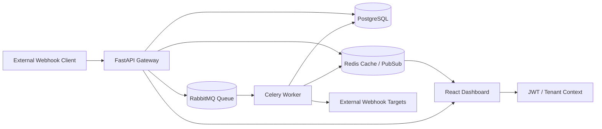
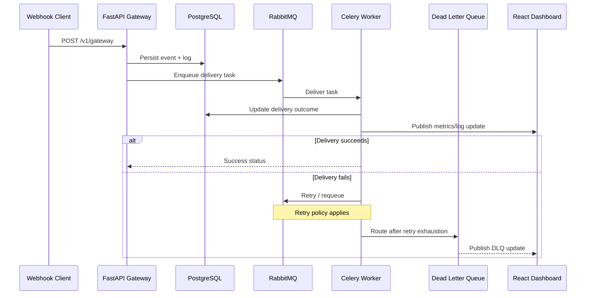
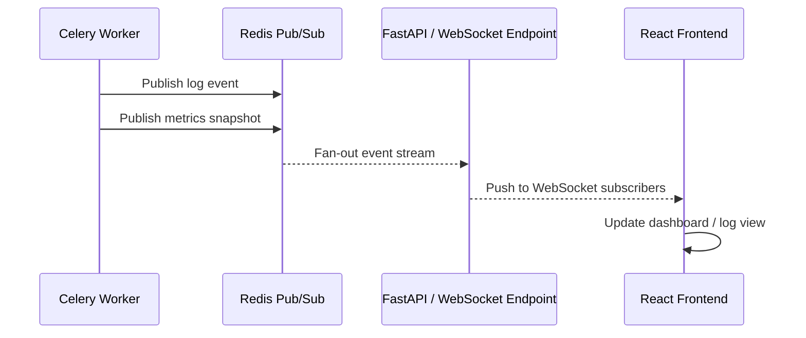

# Dameer Webhook Gateway - Enterprise Architecture & Design

## Executive Summary

Dameer Webhook Gateway is an enterprise-grade webhook infrastructure platform designed to solve the most common reliability and observability problems that appear when teams build webhook integrations in-house. Instead of treating webhook delivery as a simple HTTP POST from one service to another, the platform treats it as a first-class distributed workflow with explicit guarantees around ingestion, persistence, retries, replay, security, and telemetry.

The platform is intentionally designed around a durable, asynchronous execution model. Incoming webhook events are accepted only after strict authentication and signature validation, persisted for traceability, handed to a message broker, and processed by worker processes that can retry intelligently, surface failures into a dead-letter workflow, and publish live updates to the React dashboard without forcing the UI to poll the database.

This architecture is valuable because it preserves business continuity in the face of downstream target instability. A webhook receiver should never be “best effort” in a production environment. It should be auditable, replayable, and observable. That is the fundamental design principle behind this system.

---

## Why Build This Instead of Rewriting It In-House

### 1. Zero-Data-Loss Ingestion Strategy

A common failure mode in custom webhook systems is that the ingress layer accepts a request, then loses the message when the downstream service is temporarily unavailable. This project avoids that by decoupling ingestion from execution.

The design uses:
- FastAPI for ingestion and validation
- PostgreSQL for durable storage of webhook events and logs
- RabbitMQ as the durable broker for asynchronous delivery
- Celery workers for execution and retry orchestration

This creates a durable path from “received” to “persisted” to “queued” to “delivered or dead-lettered.” The outcome is much stronger than a simple fire-and-forget HTTP call.

### 2. Enterprise Reliability Through Replay and DLQ

Most in-house implementations only retry a handful of times and then silently drop the event. Dameer provides an operationally mature pattern:
- retries with exponential backoff and bounded attempts
- dead-letter routing on terminal failure
- manual replay and discard operations through the UI
- preserved payloads so operators can inspect and replay failures without losing context

This business value cannot be overstated. When a downstream system is down for 20 minutes, an internal team does not want to lose its webhook data. They need a reliable operating model.

### 3. Security and Compliance Alignment

The gateway performs security checks at the ingress boundary:
- API key validation and tamper detection
- HMAC verification of inbound payloads
- secret hashing and key rotation support
- payload sanitization and safe logging

These choices align well with enterprise expectations around compliance, auditability, and controlled access. The system does not simply “accept data”; it validates identity and integrity before the event is processed further.

### 4. Real-Time Telemetry for Operations Teams

Modern engineering organizations need live visibility into operational health. The platform publishes real-time delivery status, queue depth, DLQ count, and delivery metrics without requiring the frontend to poll the database every few seconds. Redis Pub/Sub and WebSocket streams provide low-latency dashboards that are operationally useful for support engineers, incident responders, and platform teams.

### 5. Multi-Tenant Isolation by Design

The codebase is structured around company- and project-level ownership. Webhook events, logs, metrics, and project credentials are scoped to the owning company. This is not an afterthought; it is fundamental to the platform design and is critical for SaaS-style or B2B deployment.

---

## Core Architectural Components and Rationale

### FastAPI Gateway Layer

The FastAPI application serves as the ingress and control plane for the platform.

Responsibilities:
- receive inbound webhook requests
- validate API keys and signatures
- enforce event-type and payload rules
- persist an event record and a log record
- enqueue work to RabbitMQ
- publish throughput and health updates

Why this layer exists:
- FastAPI offers a very strong balance of performance, developer ergonomics, schema validation, and async support
- it allows ingress logic to remain simple while the asynchronous execution layer handles reliability concerns
- it gives the system a clean API surface for both external clients and internal UI operations

The gateway is intentionally not the place where delivery is executed. It is the place where trust, validation, and acceptance happen.

### RabbitMQ and Celery Workers

RabbitMQ is the durable transport and Celery is the execution engine.

The queue is designed to decouple the “accept the webhook” decision from the “deliver the webhook” decision. That separation is critical for reliability.

Why RabbitMQ:
- durable queue semantics
- dead-letter exchange support
- decoupled producer/consumer architecture
- strong support for retries and operational inspection

Why Celery:
- straightforward task lifecycle management
- retry policy support
- worker-based execution without blocking the API layer
- good fit for asynchronous webhook delivery workflows

The worker path is responsible for:
- resolving the target URL
- issuing the outbound HTTP delivery
- recording outcome in PostgreSQL
- publishing telemetry to Redis Pub/Sub
- routing failures to the DLQ after retry exhaustion

### Redis Pub/Sub as the Telemetry Backbone

Redis is used as more than a cache. It acts as the real-time event fan-out layer for the frontend experience.

Redis is used for:
- caching project auth configuration
- tracking metrics in sliding windows and lifetime counters
- publishing log and metrics snapshots to connected clients
- notifying UI subscribers when the DLQ changes

This keeps the UI responsive and avoids database polling. The result is a dashboard that behaves like a real operations console instead of a slow data-viewing screen.

### PostgreSQL as the System of Record

PostgreSQL is the durable repository for business state and operational evidence.

It stores:
- companies
- projects
- event configurations
- webhook events
- webhook logs

Why PostgreSQL is appropriate here:
- relational integrity for multi-tenant ownership
- strong support for auditing and historical inspection
- easy join operations for reporting and analytics
- natural fit for operational records that must survive worker restarts

The system uses PostgreSQL as the authoritative source of truth while Redis serves as a fast-access acceleration and event distribution layer.

---

## Real-Time Streaming Design Rationale

### Why a Split Between Streaming Models Matters

The project is designed around the distinction between one-way event streaming and high-frequency interactive analytics.

A strictly one-way log feed is ideal for a stream where the consumer only needs to receive events as they occur. In that case, the transport can be simple and lightweight.

A dashboard metrics experience, by contrast, needs:
- two-way operational semantics
- richer state updates
- low-latency refreshes
- connected, interactive behavior

### Current Implementation and Architectural Intent

The current codebase uses WebSocket-based streaming for both live logs and dashboard metrics. That is a pragmatic and effective choice because it keeps the browser experience consistent and supports a unified authentication model with push-based delivery.

From an architecture perspective, the design intent is still clear:
- log events are one-way observations of system behavior
- dashboard metrics are stateful, interactive, and high-frequency
- Redis Pub/Sub provides the internal fan-out mechanism that powers the UI experience

In a future evolution, an SSE-based endpoint could be introduced for strictly one-way log streaming, but the current implementation chooses WebSocket transport for operational consistency and lower implementation friction.

---

## Failure Handling and DLQ Lifecycle

### Normal Delivery Path

1. The gateway accepts and validates the webhook.
2. The event is persisted in PostgreSQL.
3. A delivery task is pushed into RabbitMQ.
4. A Celery worker picks up the task.
5. The worker attempts the outbound HTTP delivery.
6. The worker records the outcome in PostgreSQL and publishes telemetry to Redis Pub/Sub.

### Retry Path

If the delivery fails transiently, the worker retries the task according to the configured policy. This is important because many webhook failures are caused by temporary network or downstream unavailability rather than permanent configuration errors.

### DLQ Path

When retries are exhausted, the worker routes the event to the dead-letter exchange and queue. This creates a controlled failure workflow rather than an uncontrolled silent loss.

The DLQ lifecycle includes:
- inspection of failed payloads
- filtering by company and project ownership
- manual replay into the main queue
- manual discard for permanent poison messages
- notification to real-time subscribers so the UI reflects the change immediately

### Why This Matters Operationally

A dead-letter workflow is essential in any serious messaging system. It protects the platform from poison messages that would otherwise cause endless retries. It also gives operators a replay mechanism to recover from temporary downstream incidents without reprocessing everything blindly.

---

## Deployment Topology

The project is designed to run as a containerized distributed system with the following runtime units:
- PostgreSQL database
- Redis cache and Pub/Sub broker
- RabbitMQ message broker
- FastAPI backend
- Celery worker
- React frontend served through Nginx

This topology is suitable for development, staging, and production-style deployment because each concern has a dedicated runtime boundary and can be scaled independently.

---

## Mermaid Diagrams

### High-Level System Architecture

### Webhook Lifecycle Sequence

### Real-Time Telemetry Flow

---

## Architectural Summary

The Dameer Webhook Gateway is not merely a wrapper around HTTP delivery. It is a durable, multi-tenant webhook operations platform with a clear separation of concerns:
- ingress and validation at the gateway layer
- asynchronous execution through RabbitMQ and Celery
- durable state in PostgreSQL
- real-time telemetry through Redis Pub/Sub and WebSockets
- human operational recovery through DLQ replay and discard workflows

That combination is what makes the system enterprise-grade rather than merely functional.
