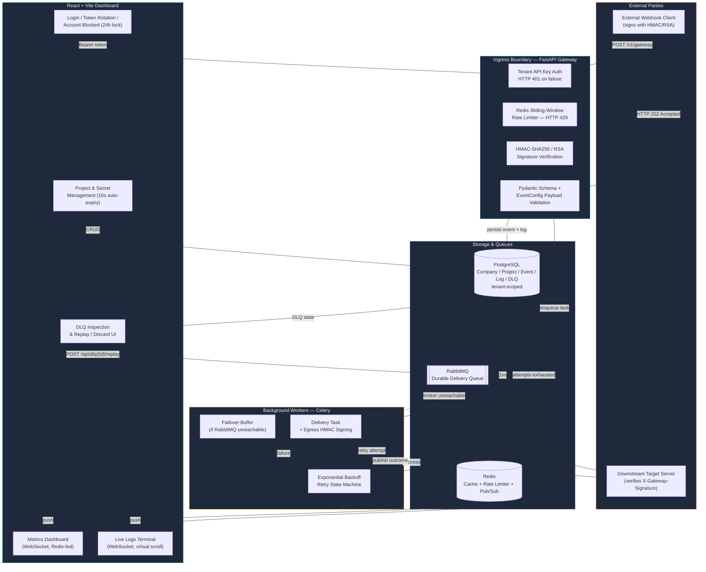
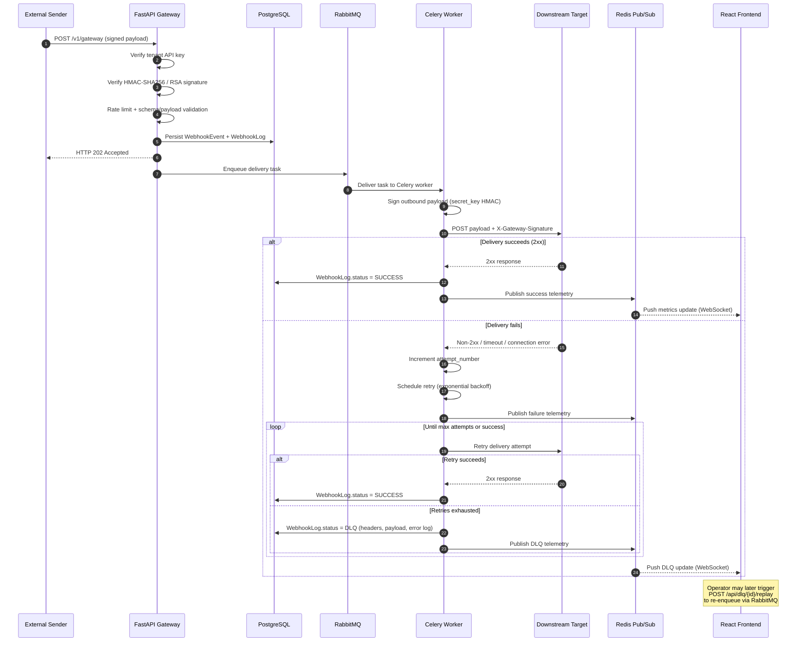
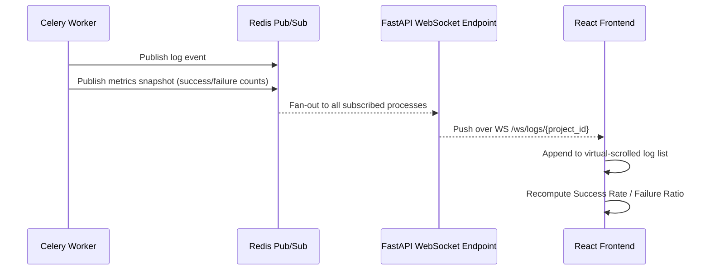
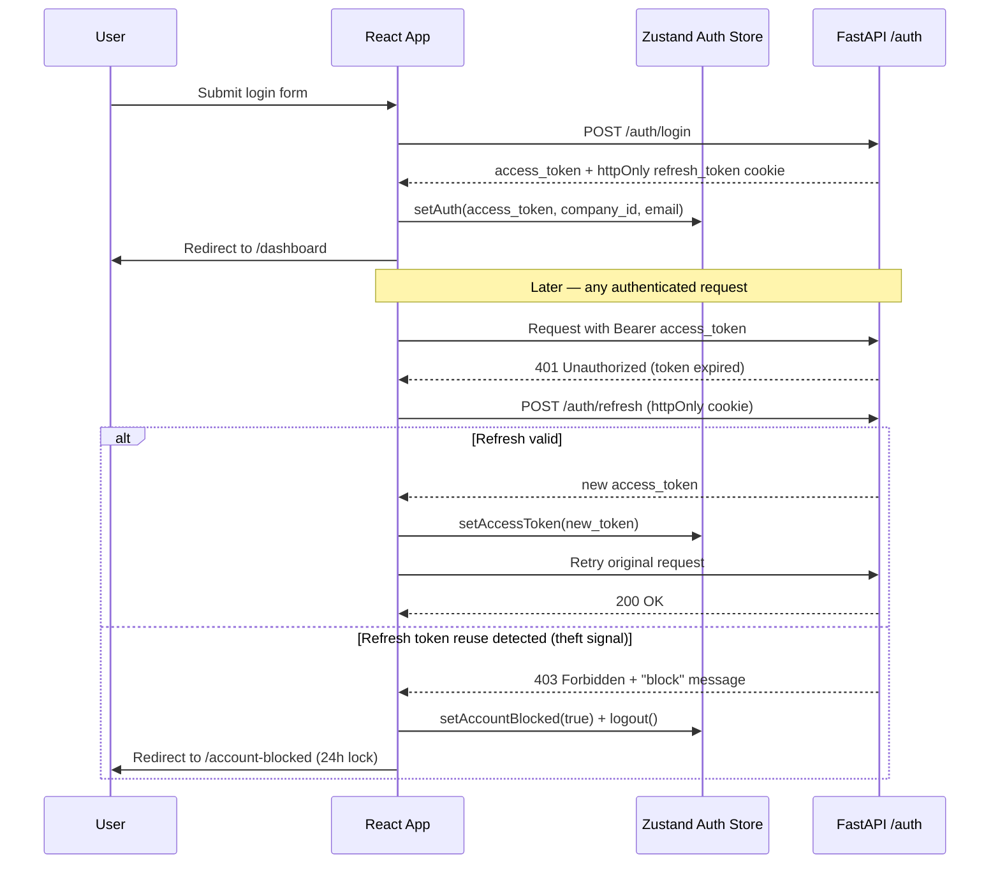
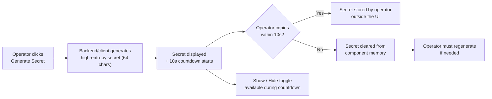

# EDS Engine — Flow Diagrams

Visual system topology and lifecycle sequences, covering both backend delivery and frontend session flows. Diagrams are written in [Mermaid](https://mermaid.js.org/) and render natively in GitHub/GitLab and most Markdown viewers.

---

## 1. High-Level System Architecture Topology

---

## 2. End-to-End Webhook Lifecycle Sequence

---

## 3. Real-Time Telemetry Fan-Out

*Design intent: live logs are conceptually one-directional (SSE-shaped) while dashboard metrics are conceptually bidirectional (WebSocket-shaped). The current implementation carries both over WebSocket for consistency — see `ARCHITECTURE.md` §2.5.*

---

## 4. Frontend Authentication & Token Rotation Flow

---

## 5. Secret Generation & Auto-Expiry Flow

---

## 6. Diagram Fidelity Notes

- No diagram shows the ingress path making a direct, blocking call to a downstream target — every delivery goes through RabbitMQ → Celery, matching `ARCHITECTURE.md` §1.2.
- The DLQ replay loop closes back into **RabbitMQ**, not directly into the worker, so a replayed message re-enters the same durable queue and retry state machine as a fresh event.
- The telemetry diagram (§3) and its note make explicit that live-log and metrics traffic currently share one WebSocket transport, rather than implying a shipped SSE endpoint that doesn't yet exist in code.