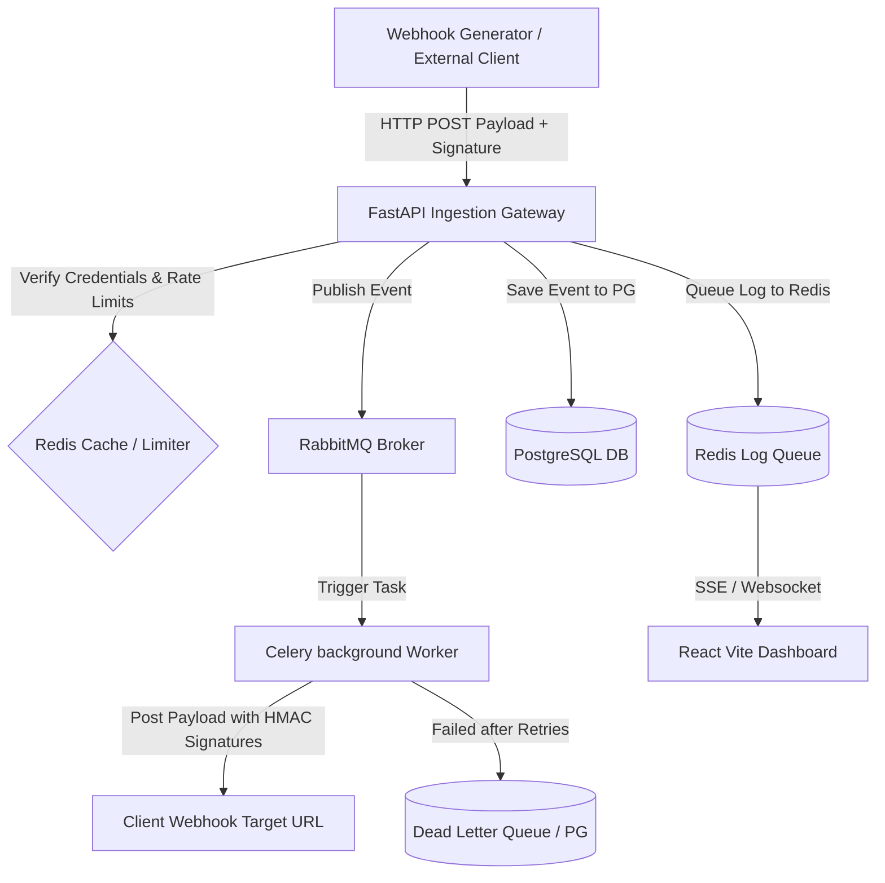
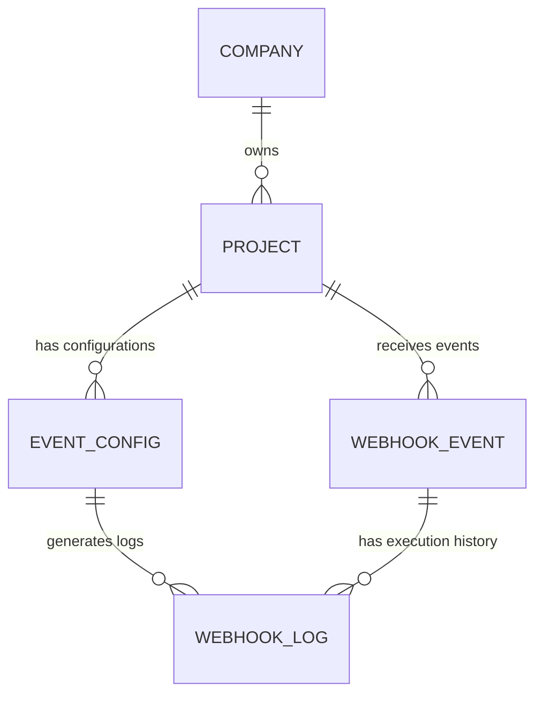

# 🚀 Dameer Webhook Gateway (WEDS Engine) - Detailed Project Documentation

Ye document aapke complete full-stack **Dameer Webhook Gateway (Unified Event Delivery Engine)** project ki architectural structure, file-by-file code detail, frontend designs, functional workflows, aur future scope ko simple Roman Urdu aur clean Markdown tables ke sath detail me explain karta hai.

---

## 📋 Table of Contents
1. [Overview: Project Kia Hai?](#1-overview-project-kia-hai)
2. [High-Level System Architecture](#2-high-level-system-architecture)
3. [Backend Code Structure & Directory Detail](#3-backend-code-structure--directory-detail)
4. [Frontend React App Structure & Pages Detail](#4-frontend-react-app-structure--pages-detail)
5. [Database Schema (PostgreSQL Models)](#5-database-schema-postgresql-models)
6. [Core Workflows (How Webhooks Ingest & Deliver)](#6-core-workflows-how-webhooks-ingest--deliver)
7. [Security Infrastructure](#7-security-infrastructure)
8. [Future Enhancements & Features](#8-future-enhancements--features)
9. [Project Setup & Commands](#9-project-setup--commands)

---

## 1. Overview: Project Kia Hai?

**Dameer Webhook Gateway** ek production-ready **Webhook Management System** hai. Ye system external APIs se aane wale webhooks ko register aur process karta hai, aur unhe verify karne ke baad unke configured targets (URLs) par end-to-end deliver karta hai. 

Is project ke piche key idea ye hai ki:
- **Centralized Webhook Control**: Aap ek hi dashboard se multiple **Projects** manage kar sakte hain.
- **Payload Schema Validation**: Har webhook event ke liye keys aur unke data types validate kiye ja sakte hain (e.g., check karna ke raw data me `amount` number hai ya nahi).
- **Asynchronous & Scalable Delivery**: RabbitMQ aur Celery background workers ka use karke high throughput ensure kiya jata hai.
- **Failover & Reliability**: Agar target URL down ho to system automatic retries aur **Dead Letter Queue (DLQ)** me fail messages bhejta hai taake user unhe baad me debug aur replay kar sake.

---

## 2. High-Level System Architecture

Niche diya gaya diagram system ke pure flow ko visually showcase karta hai:



---

## 3. Backend Code Structure & Directory Detail

Backend folder structure **FastAPI standard practices** aur layered architecture ko follow karta hai:

```
backend/
├── app/
│   ├── models/        # Database tables schema (SQLAlchemy)
│   ├── routers/       # API endpoints definitions (FastAPI APIRouter)
│   ├── schemas/       # Request validation & Response structures (Pydantic)
│   ├── services/      # Logic engines (Celery worker, rate limiters, DB ops)
│   └── utils/         # Helper functions (HMAC, verification)
├── database.py        # Database engine & async session instantiation
├── main.py            # Entry point for FastAPI, setup middlewares, lifespans
├── config.py          # Settings and Environment parser
└── Dockerfile         # Docker build file for backend container
```

### File-by-File Detailed Explanation

| File Path | Description / Purge |
| :--- | :--- |
| [main.py](file:///d:/internship/backend/main.py) | **System Entrance**: FastAPI instance create karta hai. Isme database recovery routine setup hai jo startup par PENDING (stuck) messages ko scan karke dobara RabbitMQ queue me daalta hai taake database loss na ho. CORS rules, routes define karta hai. |
| [database.py](file:///d:/internship/backend/database.py) | **DB Client**: PostgreSQL ke asyncpg engine aur async session pools create karta hai. `get_db()` database helper method provide karta hai. |
| [config.py](file:///d:/internship/backend/config.py) | **Config Loader**: Environment variables (`.env`) se databases, Redis, RabbitMQ URLs aur API secrets load karta hai. |
| **Routers (`backend/app/routers/`)** | |
| ├─ [gateway.py](file:///d:/internship/backend/app/routers/gateway.py) | **Ingestion Handler**: `/v1/gateway` endpoint manage karta hai. Aane wale webhooks ke credentials check karta hai, rate-limiting lagata hai, data save karta hai aur delivery task Celery ko hand-over karta hai. |
| ├─ [auth.py](file:///d:/internship/backend/app/routers/auth.py) | **User Auth API**: Login, Register, JWT Token Rotation, aur suspicious account lock security feature control karta hai. |
| ├─ [project.py](file:///d:/internship/backend/app/routers/project.py) | **Project Manager API**: Projects CRUD operations, metrics collection, data retention custom parameters setup karta hai. |
| ├─ [company.py](file:///d:/internship/backend/app/routers/company.py) | **Organization Setup**: Companies CRUD, users limits mapping handles. |
| ├─ [logs.py](file:///d:/internship/backend/app/routers/logs.py) | **Activity Logs Provider**: Event log logs search, live websocket message queue updates streams. |
| ├─ [target_webhook.py](file:///d:/internship/backend/app/routers/target_webhook.py) | **Sandbox Receiver**: Target testing URLs simulation endpoints. |
| **Services (`backend/app/services/`)** | |
| ├─ [celery_worker.py](file:///d:/internship/backend/app/services/celery_worker.py) | **Delivery Agent**: Background worker jo background threads me target server par webhook post karta hai. Isme retry logic with exponential backoffs aur headers signature calculation built-in hain. Daily database cleanup beat routine chalata hai. |
| ├─ [rate_limiter.py](file:///d:/internship/backend/app/services/rate_limiter.py) | **Spam Control**: Redis-based sliding window rate-limiter check karta hai ke user project limits (e.g. 100 requests per minute) exceed na kare. |
| ├─ [redis_client.py](file:///d:/internship/backend/app/services/redis_client.py) | **Cache Connector**: Connection helper classes for caching. |
| ├─ [pubsub_service.py](file:///d:/internship/backend/app/services/pubsub_service.py) | **Realtime broadcaster**: Redis pub/sub mechanism use karke frontend ko live metrics update feed bhejta hai. |
| ├─ [metrics_service.py](file:///d:/internship/backend/app/services/metrics_service.py) | **Engine Statistics**: Database queries scan karke success rates, count ratios, latencies data calculate karta hai. |
| ├─ [failover.py](file:///d:/internship/backend/app/services/failover.py) | **Failover Engine**: Agar RabbitMQ offline ho jaye, to aane wale webhooks local buffer memory/db me hold karta hai aur systems status monitor karta hai. |
| ├─ [queue_client.py](file:///d:/internship/backend/app/services/queue_client.py) | **RabbitMQ Wrapper**: Queue creation aur directly messages push support. |
| └─ [dependencies.py](file:///d:/internship/backend/app/services/dependencies.py) | **FastAPI Dependencies**: Security checks and endpoints route authorization. |

---

## 4. Frontend React App Structure & Pages Detail

Frontend ek **Single Page Application (SPA)** hai jo **Vite + React** ke framework par built hai. UI styling ke liye clean modern visual systems follow kiye gaye hain.

### Directory Layout
```
frontend/
├── src/
│   ├── api/             # API client setup (Axios configs + interceptors)
│   ├── components/      # UI components (sidebar, test widget, dashboard cards)
│   ├── context/         # React Context for global auth state
│   ├── store/           # Zustand store state management
│   ├── pages/           # Route views/pages
│   └── styles.css       # Core styling & custom animations
├── index.html           # Main template
└── vite.config.js       # Vite configuration
```

### Detailed Pages & Components Overview

1. **Dashboard Overview (`DashboardPage` + `MetricsDashboard`)**:
   - Ye main landing center hai jahan charts and stat cards lage hain.
   - **Throughput Metrics**: Live graph (SVG-based activity chart) dikhata hai ke pichle 60 seconds me kitne Success, Failed aur Pending events the.
   - **Service Status Indicators**: Database, Redis cache, aur Celery worker live connection check monitors.

2. **Projects Hub (`ProjectsPage`)**:
   - Client projects ka absolute list grid dikhata hai.
   - Active status toggles aur direct links.

3. **Project Settings & Configurations (`ProjectDetailPage`)**:
   - **Details Edit**: Project title aur toggle activation state.
   - **Credentials Control**: Generates API Keys and Secret Keys. Secret key generate hone par **10 seconds security countdown** ke baad screen se vanish ho jati hai memory cleanup ke liye.
   - **Event Types mapping**: Mapping set karta hai (e.g. `order.created` ko kis forwarding target URL par bhejenge). Multi-destination routing configuration support.
   - **Payload Schema Validation**: Aap input field add karke payload keys (e.g. `event.id`) and target types (`string`, `number`, `boolean`) bind kar sakte hain taake automatic parser rules generate ho sakein.
   - **Data Retention and Purges**: Purge policies enable karta hai. Din define kar sakte hain (e.g. logs 7 days ke bad delete ho jayein) ya custom intervals / specific date configuration setup kar sakte hain.

4. **Live Logs Inspector (`LogsPage`)**:
   - WebSocket pipeline se direct backend events stream log terminal.
   - Live filters, live query matching, download text files option, pause toggle.

5. **Dead Letter Queue Hub (`DLQPage`)**:
   - Har fail webhook jo target delivery me abort ho gaya tha yahan store hota hai.
   - **Failed Reason**: Dikhaata hai ke error status code kya tha (e.g., 504 Timeout or 400 Bad Request).
   - **Bulk Replay**: Selected events ko tick lagakar single click par backend queue me replay/resend kiya ja sakta hai.
   - **Manual Payload Copy**: Copy payload to curl test command.

6. **Authentication Views (`LoginPage` & `RegisterPage`)**:
   - Modern smooth Framer-motion layout user profiles creation screen.

7. **Secured Lockout page (`AccountBlocked`)**:
   - UI session automatically freeze ho jata hai if a security breach detected by network middleware.

---

## 5. Database Schema (PostgreSQL Models)

Database tables ke structures aur relations niche explain kiye gaye hain:



1. **`Company`**: Organization information store karta hai.
   - `id`, `name`, `is_active`, `created_at`.
2. **`Project`**: Ek company ke under different system environments.
   - `id`, `company_id` (foreign key), `name`, `api_key`, `secret_key` (HMAC), `retention_days`.
3. **`EventConfig`**: Har event type ke delivery targets aur verification logic define karta hai.
   - `id`, `project_id` (foreign key), `event_type` (e.g., `user.signup`), `target_url`, `payload_keys` (Validation list), `payload_types`.
4. **`WebhookEvent`**: Gateway par receive hone wale har unique event payload data backup.
   - `event_id` (UUID), `project_id` (foreign key), `event_type`, `payload` (JSON), `created_at`.
5. **`WebhookLog`**: Event delivery aur retries reports table.
   - `id`, `event_id` (foreign key), `status` (`PENDING`, `SUCCESS`, `FAILED`, `DLQ`), `attempt_number`, `response_code`, `processing_duration_ms`, `error_message`, `created_at`.

---

## 6. Core Workflows (How Webhooks Ingest & Deliver)

### Webhook Receive/Ingestion Flow
1. External platform (like Stripe/GitHub or user's app) API signature ke sath gateway par target endpoint `/v1/gateway` hit karti hai.
2. Gateway project `api_key` ke zariye project search karta hai.
3. System incoming HTTP request headers verify karta hai (`signature-header`).
4. Rate limiter target project ke current transaction metrics limit match karta hai.
5. Agar user ne `EventConfig` me criteria rule setup kiye hue hain, to parser checks matching payload pattern properties (types check).
6. Payload Database me save ho jata hai (`WebhookEvent` with status `PENDING`).
7. Fast processing task create hota hai jo RabbitMQ server standard queue list me dispatch ho jata hai.

### Webhook Delivery Flow
1. Background **Celery Worker** queue se message pull karta hai.
2. Target endpoints properties extract ki jati hain.
3. Target URL validation logic check hoti hai.
4. HTTP POST request prepare hoti hai aur client configuration signature calculate kar ke headers me apply hoti hai (`X-Gateway-Signature` with HMAC verification).
5. Target URL request process hone par response output status evaluate hota hai:
   - **Success (200-299)**: Event status `SUCCESS` mark ho jata hai database table `WebhookLog` me.
   - **Fail (4xx, 5xx, or network timeout)**: Retries execute hoti hain. Custom wait time (Exponential Backoff) ke baad dobara attempt kiya jata hai.
   - **Dead Letter Queue (DLQ)**: Max retries limit breach hone par event status permanent database `DLQ` mark ho jata hai aur system operator alert screen (DLQ UI panel) me register kar deta hai.

---

## 7. Security Features

Dameer Webhook Gateway security-first application hai jisme advanced layers features implementations hain:

* **HMAC Ingress Signature Verification**: Webhook receive karte waqt system use authenticate karta hai secure client authentication parameters key mapping se.
* **HMAC Egress Signature**: Webhook deliver karte waqt worker payload ko target project ke `secret_key` se digest kar ke `X-Gateway-Signature` headers send karta hai taake target client system incoming webhook authenticate kar sake.
* **Auto-Expiring Secrets**: UI console me generate keys 10 seconds bad clear/hide ho jati hain.
* **Session Security Interceptor**: Axios auth client, JWT parsing tokens check me kisi anomalies (Refresh token reuse) validation failures par user context clear kar ke 24-hours access block security screen layout render kar deta hai.

---

## 8. Future Scope & Potential Features

Aage is project ko mazeed expand karne ke liye ye advanced features add kiye ja sakte hain:

1. **Auto-Scalable Retry Schedule Customizer**: Users details dashboard se manually input customize kar sakein ke delivery failures par 5 mins, 30 mins, ya 2 hours ke custom back-offs schedule ho sakein.
2. **Payload transformation interface**: Frontend par mapping builder create karna jisme target URL format ke mutabiq keys modify ki ja sakein before posting (e.g. renaming `order_id` to `id`).
3. **Advanced Alert system (Email/Slack Integration)**: Agar kisi project me failures success rate 80% se drop ho ya DLQ size exceed kare, to immediate emails or slack channels webhooks crash configuration templates trigger ho sakein.
4. **GraphQL Support API**: Ingress gateway endpoints par dynamic JSON structure parser engine add kiya jaye.
5. **Team Workspaces & Roles management**: Team user roles limits mapping control panels access keys access authorization options.

---

## 9. Project Setup & Commands

### Services Development Setup
Fast running locally in the development environments without Docker setups:

```bash
# 1. Start RabbitMQ and Redis Services
docker run -d -p 5672:5672 -p 15672:15672 --name my-rabbitmq rabbitmq:3-management
docker run -d -p 6379:6379 --name my-redis redis:alpine

# 2. Run Backend server setup
cd backend
python -m venv .venv
source .venv/bin/activate  # On Windows: .venv\Scripts\activate
pip install -r requirements.txt
alembic upgrade head
python run.py

# 3. Start Celery worker in separate shell
celery -A app.services.celery_worker.celery_app worker --loglevel=info

# 4. Run Frontend local dev server
cd frontend
npm install
npm run dev
```

### Docker Compose Complete Setup (Recommended)
Automated infrastructure orchestration step:
```bash
# Single command build
docker-compose up -d --build
```
Is command se standard databases, message queues, caches, routers service systems container networks auto deploy ho jaate hain.

---
*Created by Antigravity AI assistant for Dameer Internship Project.*
