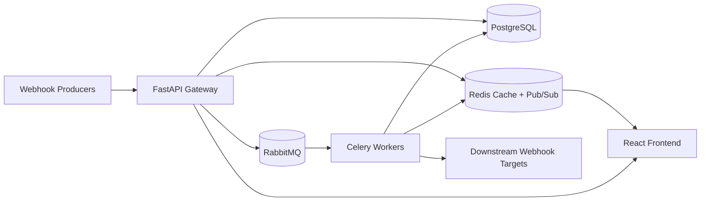
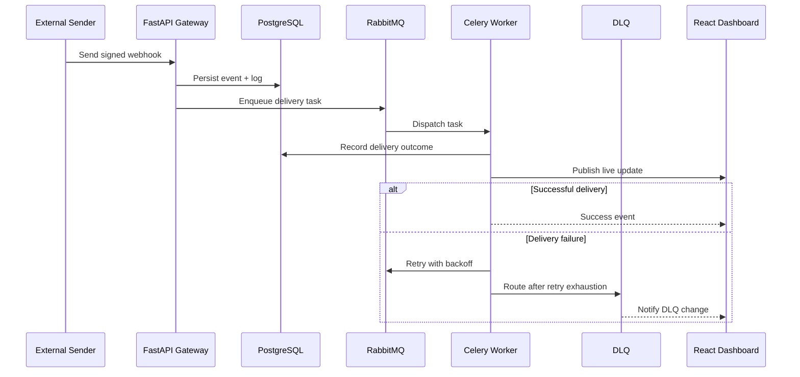

# Dameer Webhook Gateway


Dameer Webhook Gateway is a production-oriented webhook delivery and observability platform for organizations that need reliable inbound webhook ingestion, asynchronous execution, dead-letter recovery, and live operations telemetry. The system is designed to be more than an endpoint listener; it is a durable integration backbone that helps teams deliver webhooks safely across distributed systems.

## Why This Platform Matters

Modern engineering teams often build custom webhook receivers that work for a while and then fail under real operational conditions. The main pain points are:
- transient downstream failures
- lack of replay capability
- poor visibility into queue health
- weak security at the ingress boundary
- fragile dashboards that need constant polling

Dameer addresses these challenges with a composition of:
- FastAPI-based ingress and validation
- RabbitMQ and Celery for durable asynchronous execution
- PostgreSQL as the source of truth for audit and recovery
- Redis Pub/Sub for live event fan-out
- React dashboards for monitoring, logging, and DLQ operations

## Enterprise Features

- Secure inbound webhook receipt with HMAC and API-key validation
- Multi-tenant project and company isolation
- Durable persistence of webhook events and logs
- Retry-based delivery with dead-letter routing
- Manual replay and discard workflows for failed messages
- Live dashboard metrics and log streaming
- Safe payload sanitization for auditing and logs
- Container-first deployment model for local and cloud environments

## Technology Matrix

| Layer | Technology | Primary Responsibility |
| --- | --- | --- |
| API Layer | FastAPI | Ingestion, validation, routing, health checks |
| Worker Layer | Celery | Asynchronous webhook delivery and retries |
| Broker | RabbitMQ | Durable task transport and DLQ routing |
| Cache / Fan-Out | Redis | Metrics caching and Pub/Sub event distribution |
| System of Record | PostgreSQL | Persistent event, log, project, and company state |
| UI Layer | React + Vite | Dashboard, logs, project management, DLQ operations |
| Runtime | Docker Compose | Local orchestration of all services |

## High-Level System Architecture



## End-to-End Webhook Flow



## Local Installation

### Prerequisites

- Docker Desktop or Docker Engine
- Docker Compose
- Git

### Quick Start

```bash
git clone <repository-url>
cd internship_project
cp .env.example .env
docker compose up -d --build
```

### Services

Once the stack is running:

- Frontend: http://localhost
- Backend API: http://localhost:8000/docs
- RabbitMQ UI: http://localhost:15672
- PostgreSQL: localhost:5432
- Redis: localhost:6379

### Environment Variables

The project uses a Docker-friendly environment file. A baseline example is included at [.env.example](.env.example).

Key variables:
- DATABASE_URL
- REDIS_URL
- RABBITMQ_URL
- SECRET_KEY
- POSTGRES_USER / POSTGRES_PASSWORD / POSTGRES_DB

## Deployment Notes

The stack is designed to run as a containerized set of services. Each runtime concern is isolated:
- the API layer handles ingress
- workers execute webhook delivery
- Redis provides low-latency telemetry fan-out
- PostgreSQL holds durable business state

For production deployment, the project should be hardened with:
- managed PostgreSQL and Redis services
- secret management for credentials
- TLS termination and ingress controls
- container image scanning and runtime monitoring

## Documentation

- Architecture reference: [ARCHITECTURE.md](ARCHITECTURE.md)
- Integration checklist: [INTEGRATION_CHECKLIST.md](INTEGRATION_CHECKLIST.md)
- Quick start: [QUICKSTART.md](QUICKSTART.md)
- Project documentation: [PROJECT_DOCUMENTATION.md](PROJECT_DOCUMENTATION.md)
